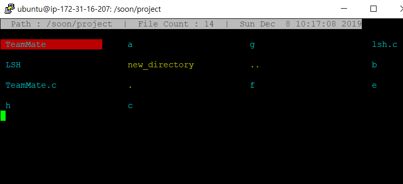
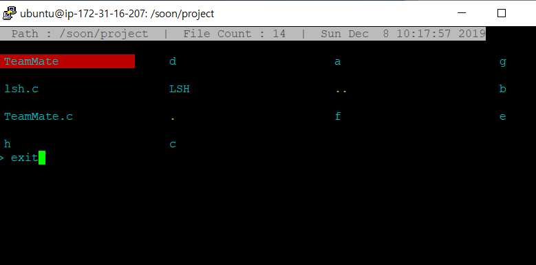

project members
===
Team No.12 B589006 김순, B589025 박양수, B589060 임성묵

Reason for selecting project
===
We study opensource class for 6months. While learning this class, most of Student think hard in command line linux because black background, and first experience is Command environment. And Control command handle stickle. And our team added shell function to make it more intuitive and user-friendly and convenient handle file. Enjoy our added functions.

Additional Options
===
  * Improved readability and more conveniently
  * Anyone easily handle file (move, copy, paste, delete, make directory)

How to use functions?
===
```

Usage: press the key below description

press key [--similar to existing linux command]  description command

  W,                      cursor move up
  A,                      cursor move left
  S,                      cursor move down
  D,                      cursor move right
  E, --excute             excute output file or program file
  Q, --quit               this shell function exit
  Z, --delete             delete the file pointed to the current cursor
  N, --mkdir              make new directory 
  C, --copy               copy the file pointed to the current cursor
  X, --move               move the file pointed to the current cursor
  V, --paste              paste the file by copyed or moved
```


[1]: http://brennan.io/2015/01/16/write-a-shell-in-c/

<br>
* excute LSH shell(our team fork LSH shell) <br>

<br>
* run added function shell<br>

<br>
* move cursor by “W or A or S or D” key pressed and excute file “E” key pressed <br>

<br>
* make directory by “N” key pressed<br>

<br>
* check new directory  <br>
<br>
* Press key “C” to copy the file at the current cursor.<br>
<br>
* Press key “V” to paste the copyed file<br>
 <br>
* check above result <br> 
 <br>
* Press key “X” to cut the file at the current cursor.<br>
<br>
* Press key “V” to paste the moved file<br>

<br>
* Press key “D” to delete file or directory<br>

<br>
* Press key “Q” to quit this function shell<br>

